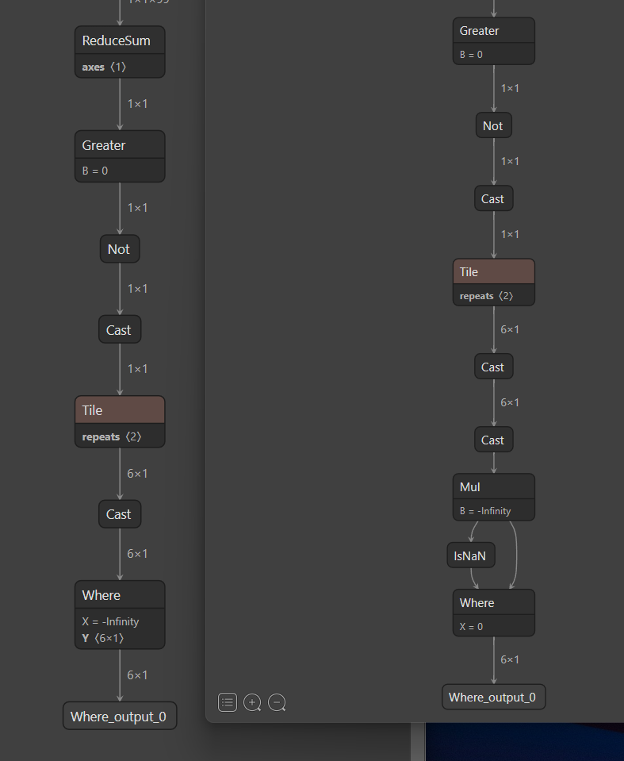

# ONNX Task

## Source of the model

 Model picked up from  '/media/bmw/simplified_emil_net.onnx'

## Description of the Task

- Task 1 : To isolate subgraph
  - start node :  reference_line_valid_mask
  - end node : planner_decoder/decoder_blocks.0/cast_1_output_0

- Task 2 : ONNX runtime script for original as well as isolate subgraph

- Task 3 : Replace the where node or  infinity with another logic and analyse MSE score

## Experiment 1

- Cast the boolean condition to float32 (True -> 1.0, False -> 0.0)

- Multiply by negative infinity to get -∞ for True conditions and NaN for False conditions

- Use IsNaN to detect NaN values

- Use another Where node to replace NaNs with zeros while keeping non-NaN values



## Execution command

Command to run:

- Inferencing full original model and modified full model  and MSE comparsion

   ```bash
   python src/inference_full_model.py
   ```

- Inferencing Isolated model and modified isolated model and MSE comparsion

   ```bash
   python src/inference_iso_model.py
   ```

- Modifying full model  with logic

   ```bash
   python src/modify_full_model.py
   ```

- Modifying isolated model with logic

   ```bash
   python src/modify_iso_model.py
   ```
